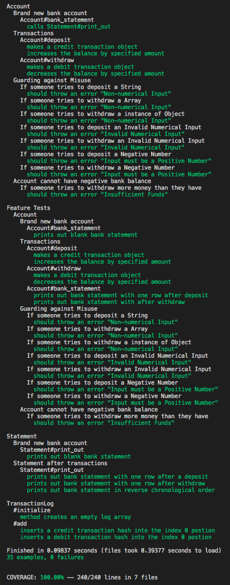

# Bank Tech Test

This is my attempt at the Bank Tech Test. User Stories implemented can be seen below.

```
As a User,
So I can see my bank balance,
I want to see a print out of my bank statement.

As a User,
So I can save money,
I want to be able to make a deposit.

As a User,
So I can spend my money,
I want to be able to make a withdrawal.

```
## My Approach

I BDD'ed this project.

`User Story --> Feature Test --> Unit Test --> Red --> Green --> Refactor --> Repeat`

## Tech

Built with

* Language      : Ruby
* Testing       : RSpec (Unit and Feature)
* Linter        : RuboCop
* Code Coverage : SimpleCov 

## Usage

1. Clone this repo to your local machine.
```
git clone https://github.com/JonathanAndrews/bank_tech_test.git
```
2. `cd` into the project.
2. `bundle install` to install all the dependencies.
2. `rspec` to run the tests.
2. The tests should look like this.



6. To interact with the software, require `account.rb` in IRB.
```
irb -r './lib/account.rb'
```

## IRB Demo
```
➜  bank_tech_test git:(master) ✗ irb -r './lib/account.rb'

2.5.1 :001 > acc = Account.new

=> #<Account:0x00007fe2580c35e0 @balance=0, @transaction_log=#<TransactionLog:0x00007fe2580c3518 @log=[]>, @statement=#<Statement:0x00007fe2580c3590>>

2.5.1 :002 > acc.deposit(1000)

 => [{:date=>"06/11/2018", :credit=>1000, :debit=>nil}]

2.5.1 :003 > acc.deposit(2000)

 => [{:date=>"06/11/2018", :credit=>1000, :debit=>nil}, {:date=>"06/11/2018", :credit=>2000, :debit=>nil}]

2.5.1 :004 > acc.withdraw(500)

 => [{:date=>"06/11/2018", :credit=>1000, :debit=>nil}, {:date=>"06/11/2018", :credit=>2000, :debit=>nil}, {:date=>"06/11/2018", :credit=>nil, :debit=>500}]

2.5.1 :005 > acc.bank_statement

date || credit || debit || balance
06/11/2018 || || 500.00 || 2500.00
06/11/2018 || 2000.00 || || 3000.00
06/11/2018 || 1000.00 || || 1000.00

 => nil

2.5.1 :006 > acc.deposit("String")

RuntimeError (Non-numerical Input)

2.5.1 :007 > acc.deposit(-50)

RuntimeError (Input must be a Positive Number)

2.5.1 :008 > acc.deposit(5.5500005)

RuntimeError (Invalid Numerical Input)

2.5.1 :009 > acc.withdraw(5000)

RuntimeError (Insufficient Funds)

```

## Sequence and Class Diagram


## Contributing

Make a pull request if you want to contribute. :)
